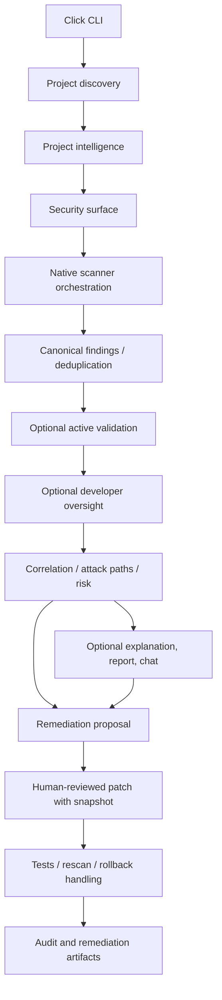
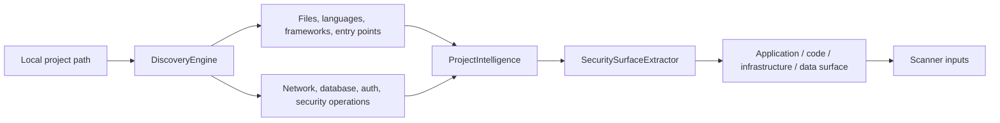
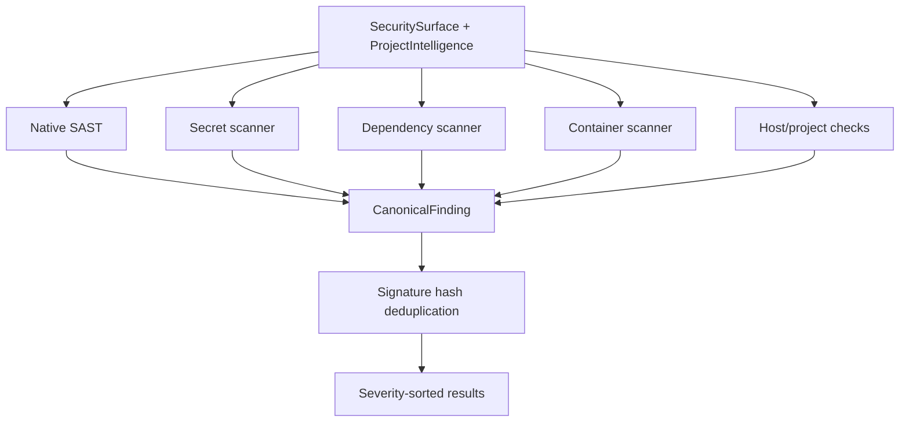
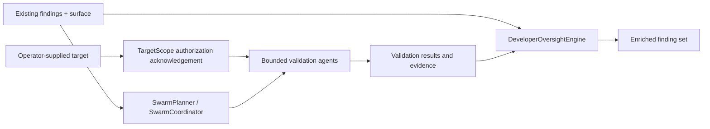
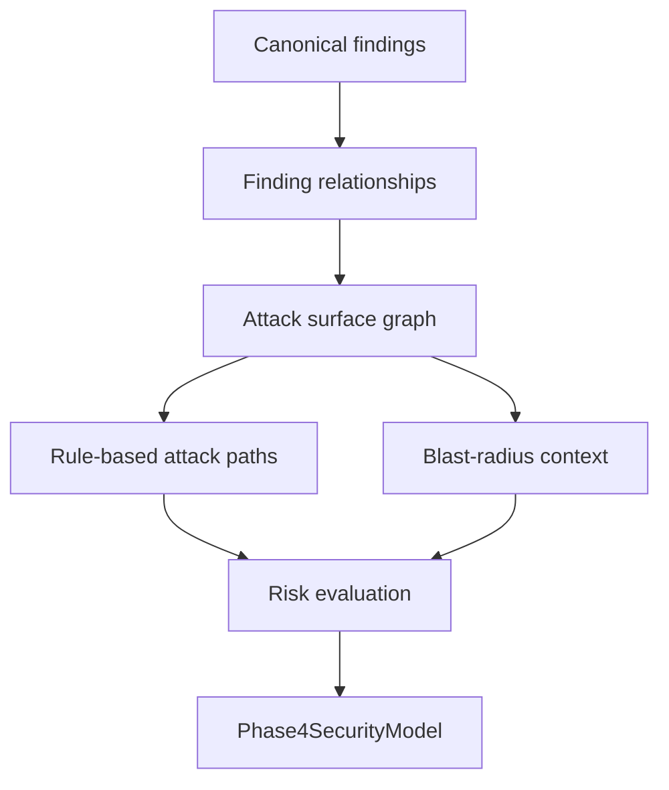
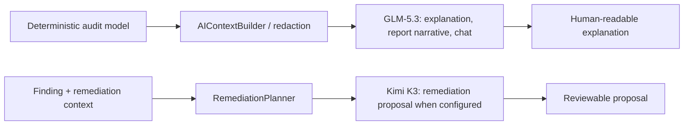
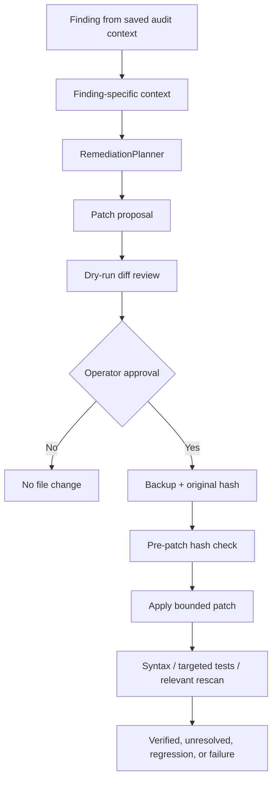
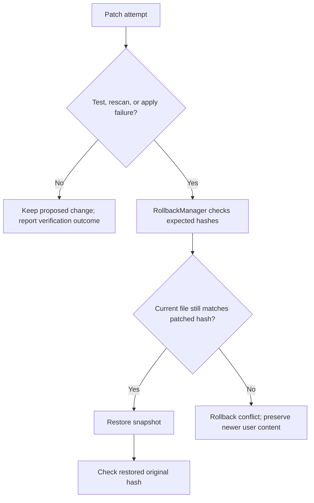
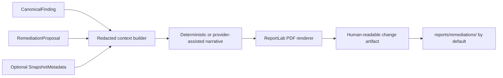

# NSAT — Network Security Audit & Threat Assessment: Architecture

## Table of Contents

- [Purpose and boundaries](#purpose-and-boundaries)
- [High-level architecture](#high-level-architecture)
- [Project analysis](#project-analysis)
- [Scanner pipeline](#scanner-pipeline)
- [Validation and oversight](#validation-and-oversight)
- [Correlation and attack paths](#correlation-and-attack-paths)
- [AI flow](#ai-flow)
- [Remediation lifecycle](#remediation-lifecycle)
- [Backup and rollback](#backup-and-rollback)
- [Verification](#verification)
- [PDF remediation reporting](#pdf-remediation-reporting)
- [Audit context](#audit-context)
- [Implementation map](#implementation-map)
- [Documentation](#documentation)

## Purpose and boundaries

This document describes the current code structure of NSAT, a CLI-first defensive audit platform. It is an architectural guide, not a claim of full security coverage. The actual implementation under `nsat/` and tests under `tests/` are authoritative. A scanner module existing does not necessarily mean a CLI command invokes it; this distinction matters for the network/host modules and placeholder commands.

## High-level architecture

`report`, `ai-report`, `explain`, `chat`, `fix`, and `verify` have distinct CLI orchestration paths. This diagram shows the conceptual flow, not a single function chain that always executes every box.

## Project analysis

Language analyzers in `nsat/analyzers/` implement the `LanguageAnalyzer` interface: language detection, structural extraction, framework and entry-point evidence, network/database/auth indicators, and security-relevant operations. Present adapters are C++, Python, Rust, Go, PHP, JavaScript/TypeScript, and Java. Coverage depth differs. Evidence is structural/configurational where available; descriptive identifiers and comments alone do not determine a finding.

## Scanner pipeline

`Phase2Orchestrator` wires native SAST, secrets, dependencies, container, and host scanners. Exceptions from individual scanners are warned and scanning continues, so results can be partial. `network` and `web` scanner modules exist; the active validation flow uses web probes against an explicitly supplied target. Do not equate these modules with implemented `nsat network` or general network-discovery CLI behavior.

## Validation and oversight

The validation swarm is opt-in and bounded by its scope/request guards. The `--authorized` switch is an explicit operator acknowledgement, not proof of permission. Oversight applies its implemented rules for configuration/deployment, client trust, error exposure, hidden endpoints, log leakage, race conditions, session cookies, and URL leakage. Both can add useful evidence but do not constitute exhaustive testing.

## Correlation and attack paths

`CorrelationEngine` builds the report model using `graph.py`, `rules.py`, `risk.py`, and `blast_radius.py`. The attack paths and risk context are derived from implemented relationships/rules; they are hypotheses for review and do not prove exploitability. Avoid quoting the old TRD’s illustrative formulas or node/edge taxonomy as implementation contracts.

## AI flow

The GLM and Kimi provider classes use configurable API-compatible base URLs and credentials. Defaults appear in `nsat/ai/config.py` and `.env.example`; they are configuration defaults, not guarantees of availability. Deterministic scanning is independent from model output. Context builders perform pattern-based redaction, which cannot promise removal of every sensitive value.

## Remediation lifecycle

`nsat fix --dry-run` previews without backup or modification. Applying requires approval unless `--yes` is supplied. Proposal generation can use Kimi if enabled/available; review remains necessary. See source in `nsat/remediation/` for exact model/status transitions.

## Backup and rollback

The normal rollback path avoids replacing changes made after NSAT's patch. `--force` can bypass conflict protections and should be treated as a potentially destructive operator override.

## Verification

`VerificationEngine` validates path/state, runs Python syntax/compilation checks when the target is Python, runs a nearby conventional `test_<stem>.py` test module when found, then performs a relevant native rescan. Other file types may not receive language-specific syntax validation. It checks whether the original finding remains and whether new critical/high findings appeared. Failures may trigger rollback; the report records outcome, tests, rescan evidence, and rollback status. This is a targeted safeguard, not a universal project-wide test suite or proof against regressions.

## PDF remediation reporting

The separate CLI is `python -m nsat.remediation_report --finding finding.json --proposal proposal.json`. It can include root cause, affected file, patch excerpt, impact, verification and backup/rollback information if those fields are available. The PDF supports human review; the finding model, scanners, and verification engine remain authoritative for security state.

## Audit context

AI-enabled audit flows save the latest redacted `Phase4SecurityModel` context at `<target>/.nsat/audit-context/latest.json`. `fix` reuses this saved context when present and otherwise builds a fresh model. `explain` and `chat` currently build context by running local analysis. `verify` reads remediation history; verification itself is part of the `fix` workflow. Do not commit audit context or generated reports: they can reveal repository paths, findings, or operational details. `.nsat/` and `reports/` are ignored by `.gitignore`.

## Implementation map

| Responsibility | Source |
| --- | --- |
| CLI | `nsat/cli/` |
| Discovery, config, surface, orchestration | `nsat/core/` |
| Language adapters | `nsat/analyzers/` |
| Native and runtime scanners | `nsat/scanners/` |
| Finding models | `nsat/normalization/` |
| Active validation | `nsat/swarm/` |
| Developer oversight | `nsat/oversight/` |
| Correlation and risk | `nsat/correlation/` |
| AI providers/context | `nsat/ai/` |
| Patch lifecycle | `nsat/remediation/` |
| Audit report renderers | `nsat/reporting/` |
| PDF change reports | `nsat/remediation_report/` |
| Regression tests | `tests/` |

## Documentation

- [README](README.md) · [PRD](PRD.md) · [TRD](TRD.md) · [Phases](Phases.md)
- [Setup](SETUP.md) · [AI Instructions](AI_INSTRUCTION.md) · [Agent Instructions](AGENTS.md)
- [Contributing](CONTRIBUTING.md) · [Security Policy](SECURITY.md)
