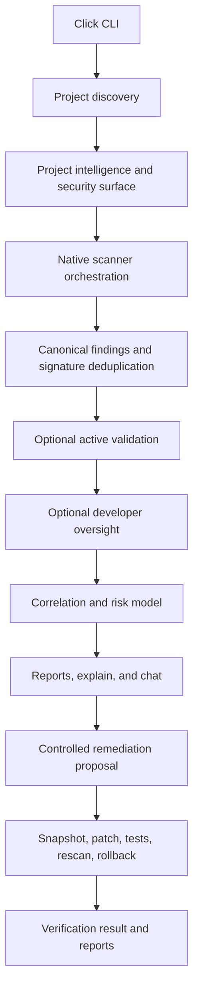
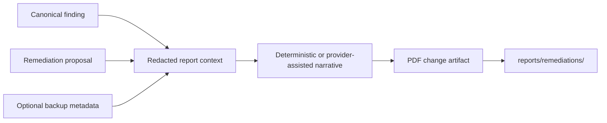

# NSAT — Network Security Audit & Threat Assessment: Technical Reference

## Table of Contents

- [System overview](#system-overview)
- [CLI and orchestration](#cli-and-orchestration)
- [Discovery and analyzers](#discovery-and-analyzers)
- [Scanners and findings](#scanners-and-findings)
- [Validation and oversight](#validation-and-oversight)
- [Correlation and risk](#correlation-and-risk)
- [AI architecture](#ai-architecture)
- [Remediation and verification](#remediation-and-verification)
- [PDF remediation reports](#pdf-remediation-reports)
- [Configuration and security boundaries](#configuration-and-security-boundaries)
- [Testing, errors, and limitations](#testing-errors-and-limitations)
- [Performance](#performance)
- [Extensibility and future architecture](#extensibility-and-future-architecture)
- [Documentation](#documentation)

## System overview

NSAT is a Python CLI organized under `nsat/`. `nsat/cli/main.py` coordinates the main use cases. `nsat/core/` handles configuration, discovery, surface extraction, and Phase 2 orchestration. Domain packages implement analyzers, scanners, validation, oversight, correlation, AI, remediation, and reporting. The implementation and tests define behavior; this reference avoids aspirational claims.



Validation and oversight are optional stages. CLI commands do not all run one identical pipeline: `audit` scans and optionally adds validation/oversight; `report` constructs correlation context; `explain` and `chat` build local analysis context; `fix` reuses saved audit context when available or builds a model; `verify` displays remediation history. Verification checks are performed by the remediation lifecycle during `fix`.

## CLI and orchestration

The root command is Click-based. Registered commands are `doctor`, `audit`, `oversight`, `validate`, `network`, `host`, `monitor`, `report`, `ai-report`, `explain`, `chat`, `fix`, `verify`, and `config`. `host`, `network`, and `monitor` are placeholders. The remediation PDF has its own argparse entry point: `python -m nsat.remediation_report`.

`Phase2Orchestrator` extracts a `SecuritySurface`, runs `NativeSASTScanner`, `SecretScanner`, `DependencyScanner`, `ContainerScanner`, and `HostScanner`, suppresses duplicate signature hashes, sorts by severity, and continues if an individual scanner throws (with a warning). It does not dynamically discover arbitrary third-party scanner plugins.

## Discovery and analyzers

`DiscoveryEngine` builds `ProjectIntelligence`, including discovered file/language distribution, project classification, framework evidence, entry points, network/database/auth indicators, and security-relevant operations. `SecuritySurfaceExtractor` maps this into application, code, infrastructure, and data-security surface models.

`LanguageAnalyzer` in `nsat/analyzers/base.py` defines language name/extensions, detection, structure, framework, entry-point, network/database/auth, and security-operation extraction. Default adapters are C++, Python, Rust, Go, PHP, JavaScript/TypeScript, and Java. Python uses Python AST parsing; each other adapter has its own implementation and heuristics. This is not a universal cross-language taint engine. Interpret generic names such as `a()`, `x()`, `foo()`, `handler2()`, and `tmp()` using surrounding structural evidence; identifiers are not security proof.

## Scanners and findings

Scanner modules are `sast`, `secrets`, `dependencies`, `container`, `host`, `network`, and `web`. The current Phase 2 orchestrator wires SAST, secrets, dependencies, containers, and host scanners. Web probing is used for explicit target validation. Network scanner module availability does not imply that the `nsat network` CLI command is implemented.

`CanonicalFinding` in `nsat/normalization/models.py` stores identifiers, category/severity/confidence, title and description, asset/location, source scanner, evidence, impact/recommendation, remediation context, and a signature hash (consult the model for exact fields). It is a Python/Pydantic model, not the stale JSON schema formerly embedded in TRD. Phase 2 deduplicates by signature; correlation performs additional normalization/merge/sanitization.

## Validation and oversight

`SwarmCoordinator` plans and runs the agents under `nsat/swarm/agents/`. The workflow consumes discovered surface and existing findings, sends bounded requests to an explicitly supplied target, and records evidence/status. `TargetScope` uses the target URL and explicit authorization acknowledgement; it is a guardrail, not legal authorization. Do not aim it at systems without permission.

`DeveloperOversightEngine` runs rules for configuration/deployment, client trust, error exposure, hidden endpoints, logging leakage, race conditions, session cookies, and URL leakage. These checks complement source scanners and do not establish a complete audit of application behavior.

## Correlation and risk

`CorrelationEngine.run(Phase4Input)` in `nsat/correlation/engine.py` assembles canonicalized findings, relationships/graph, attack paths, risk, blast-radius context, coverage, and limitations into `Phase4SecurityModel`. Supporting modules include `graph.py`, `rules.py`, `risk.py`, `blast_radius.py`, and `location.py`. Risk reflects implemented severity/confidence/context logic and should not be described using unsupported numeric formulas or assumptions from old docs. `reporting/` renders terminal, JSON, and Markdown representations.

## AI architecture

AI is separated from deterministic scanning:

```text
Deterministic Security Engine → findings, evidence, relationships, risk inputs
Security Reasoning (GLM-5.3) → explanation, security report narrative, chat
Remediation Model (Kimi K3) → proposed finding-specific patch plan
```

`LLMProvider` defines provider behavior. `GLMProvider` and `KimiProvider` use configuration from `nsat/ai/config.py`. Configurable model identifiers default to `z-ai/glm-5.3` and `moonshotai/kimi-k3`; defaults can be overridden. Base URLs and credentials are operator-configured through the corresponding environment variables, with NVIDIA/OpenAI-compatible fallbacks. Do not treat example defaults as vendor availability or a claim about service terms.

`AIContextBuilder` constructs minimized report/finding/chat contexts and redacts recognizable secret patterns. The remediation planner applies redaction to prompt context. Redaction is pattern-based and cannot guarantee discovery of every secret; review all outbound context and configure approved providers accordingly. AI failure should not erase or fabricate deterministic evidence.

## Remediation and verification

`RemediationPlanner` builds a proposal from a finding and audit context, with Kimi assistance when available and deterministic fallback behavior. `RemediationManager` coordinates approval, patching, and history. CLI `--dry-run` previews without backup/change. Applying a change creates snapshot metadata/content under the audited repository’s `.nsat` state, verifies the pre-patch file hash, and applies the proposed patch after approval. `--yes` skips the interactive approval prompt and should be used only in a controlled workflow.

`VerificationEngine` checks the target file and Python syntax when applicable, runs a conventional nearby targeted pytest module when found, and runs the relevant native rescan. Other language syntax checks may be skipped. A failed test, failed rescan, still-present finding, or new critical/high finding can trigger rollback if enabled. `SnapshotManager` and `RollbackManager` guard hashes; a mismatch becomes a rollback conflict, preserving newer user content. `--force` can override safeguards and should be treated as destructive to the changed file state. The CLI `nsat verify` command displays recorded remediation history; it does not itself initiate a fresh verification.

## PDF remediation reports

`nsat/remediation_report/` is an additive presentation layer. It accepts existing `CanonicalFinding`, `RemediationProposal`, optional `SnapshotMetadata`, and optional security model; builds a redacted report context; generates deterministic narrative or provider-assisted narrative through the provider abstraction; and renders a PDF. Default output is under `reports/remediations/` (inspect `storage.py` for path policy). The PDF can summarize issue, root cause, proposed change, affected file, patch excerpt, impact, verification plan, and backup/rollback details when supplied. It is a human-readable remediation/change artifact, not the authoritative scanner or security engine.



Command: `python -m nsat.remediation_report --finding finding.json --proposal proposal.json [--snapshot snapshot.json] [--output report.pdf]`; `--list` lists generated reports. It consumes model JSON; it does not itself run the audit or apply the patch.

## Configuration and security boundaries

Core configuration is modeled in `nsat/core/config.py`: `project`, `analysis`, `scanners`, and `ai`. It is loaded as YAML even though the loader also searches for `nsat.toml`; a TOML file is not parsed as TOML. AI provider configuration is separate and reads `AI_ENABLED`, `GLM_*`, `KIMI_*`, and supported provider fallback variables from environment/`.env`. See `.env.example`; never commit actual credentials.

Audit context is written under `<target>/.nsat/audit-context/latest.json` by AI-enabled audit flows and is redacted with the remediation redactor. Snapshot/history state is also target-local. Treat `.nsat`, `reports/`, and exported reports as sensitive. Active HTTP validation requires authorization; network/host placeholder commands must not be presented as working features.

## Testing, errors, and limitations

Tests are in `tests/test_phase1.py`, `test_phase2.py`, `test_phase3.py`, `test_phase3_5.py`, `test_phase4.py`, `test_phase4b.py`, `test_phase4c.py`, and `test_remediation_report.py`. The repo currently lacks a root dependency/package manifest, so a clean install cannot be derived from those test files alone. Do not claim a clean setup or test run without a reproducible dependency declaration.

Scanner exceptions are caught at the Phase 2 orchestration boundary and reported as warnings; downstream consumers may see partial findings. Provider timeouts/configuration errors can result in deterministic fallback or unavailable AI flows. Coverage differs by language and rule. The main report command accepts `sarif`/`html`, but the current manager’s documented formats are terminal/json/markdown; treat SARIF/HTML as not implemented. `host`, `network`, and `monitor` are not implemented CLI capabilities.

## Performance

The repository does not publish measured throughput, repository-size limits beyond configuration defaults, or performance service-level objectives. Discovery has configurable file-size and ignore-path controls; active validation has bounded request behavior. Treat performance as unbenchmarked until representative measurements are added. Do not promise linear-time scans or a scan duration based on the architecture alone.

## Extensibility and future architecture

Add analyzer implementations through `LanguageAnalyzer` and register them in `get_default_analyzers()`. Add deterministic scanner behavior under `nsat/scanners/` and wire it intentionally in `Phase2Orchestrator`; return canonical findings. Validation agents should use existing scope/rate/request guards. Oversight rules belong in the current engine/rule pattern. Provider additions should use `LLMProvider`, keep context minimal, and be explicit about fallback and secrets. Report formats need a renderer and tests before being advertised as supported.

Future architecture work includes reliable packaging/dependency metadata, implemented report formats/commands, deeper language analysis, and broader regression coverage. These are planned improvements, not shipped capabilities.

## Documentation

- [README](README.md) · [PRD](PRD.md) · [Architecture](ARCHITECTURE.md) · [Phases](Phases.md)
- [Setup](SETUP.md) · [AI Instructions](AI_INSTRUCTION.md) · [Agent Instructions](AGENTS.md)
- [Contributing](CONTRIBUTING.md) · [Security Policy](SECURITY.md)
